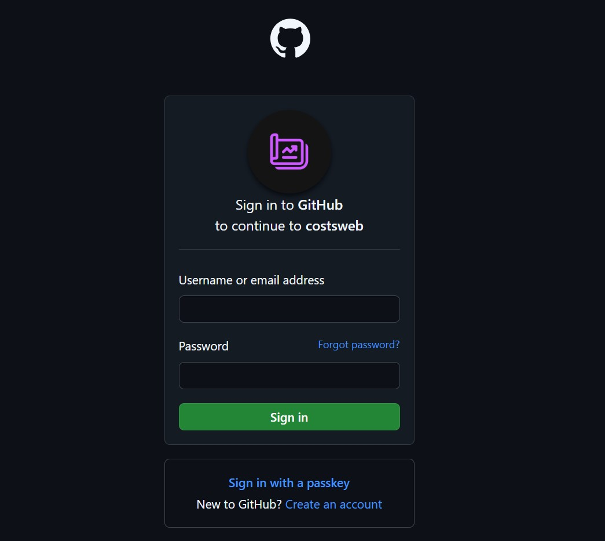

<p align="center">
 
</p>

> Authentication Logic with OAuth 2.0 with Google and GitHub

See this video by Telusko [#39 Spring Security | Google and Github Login using OAuth2](https://www.youtube.com/watch?v=xAaGxhDiGg8)

## Important 🚨

For you to be able to fork and use this project you'll need to have you own credentials from <br>
both GitHub and Google Cloud.

You can get them here: [GitHub](https://github.com/settings/applications/new) & [Google Cloud Console](https://console.cloud.google.com/) <br>

> For both options you'll have to create or select an existing project of yours !

## How to Run

- First you need to clone this to your machine
```bash
  git clone https://github.com/DevDario/spring-oauth20
```

- Then access it
```bash
  cd spring-oauth20/
```

- Now you can build the project:
```bash
$ ./mvnw clean package
```
- and then run it:
```bash
$ java -jar target/SpringOauth2-0.0.1-SNAPSHOT.jar
```

You can access the API here: [localhost:8080](http://localhost:8080).
> You will be redirected to the login form provided by OAuth2.0 if not authenticated

After you log in you can access the private route: [localhost:8080/private](http://localhost:8080/private).

## Routes

### localhost:8080 (home)<br>
   

### localhost:8080/login (login options)<br>


### with GitHub
> it says "Costs" because I'll use it on another project of mine


### with Google


### localhost:8080/private (secured route, accessed only by authenticated 'entity's')<br>
